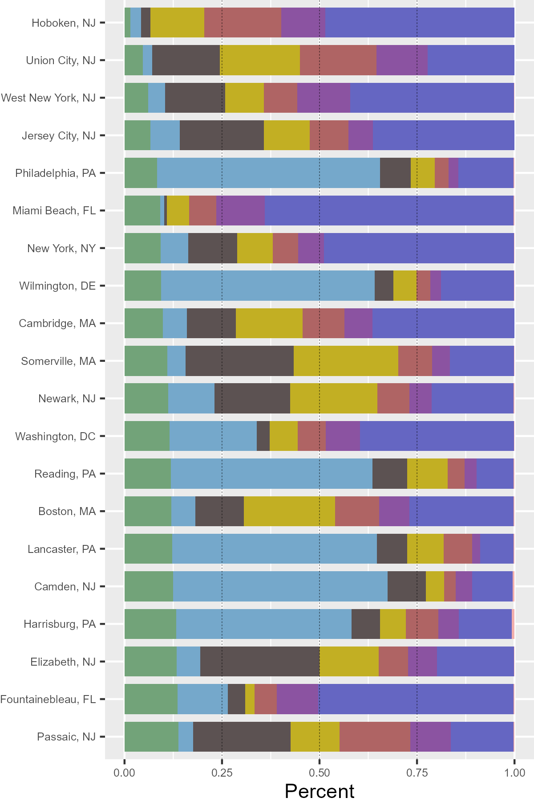
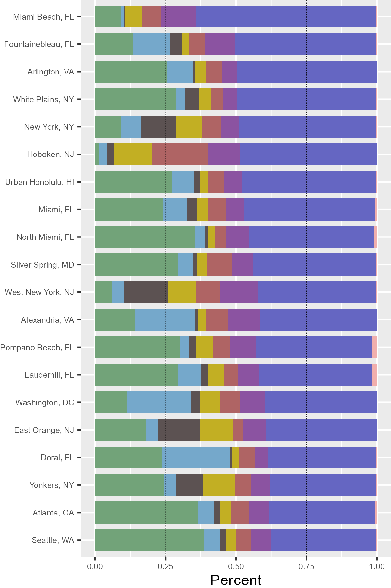
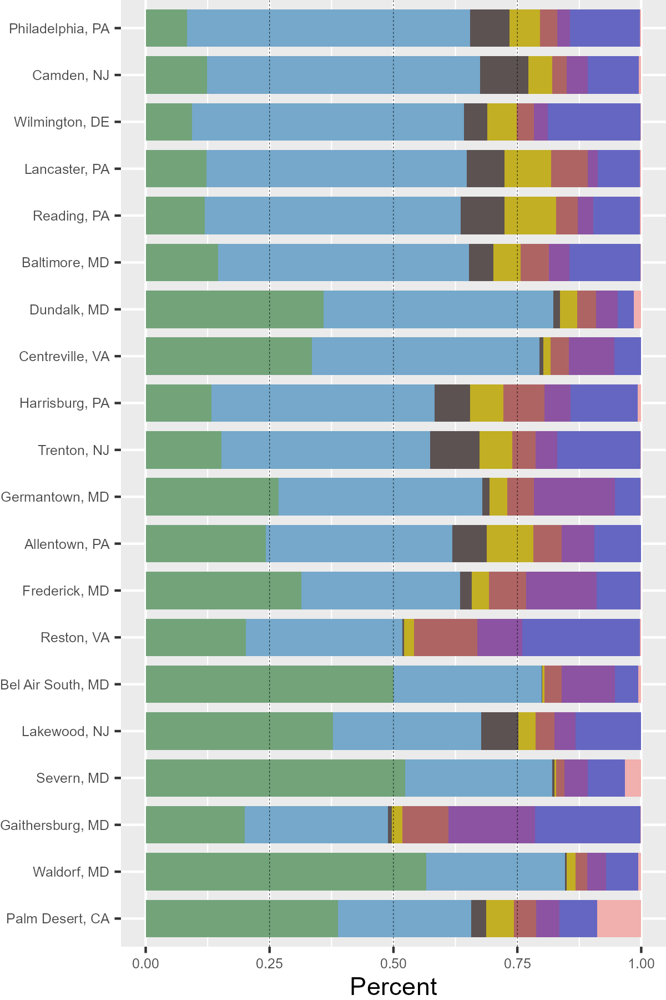
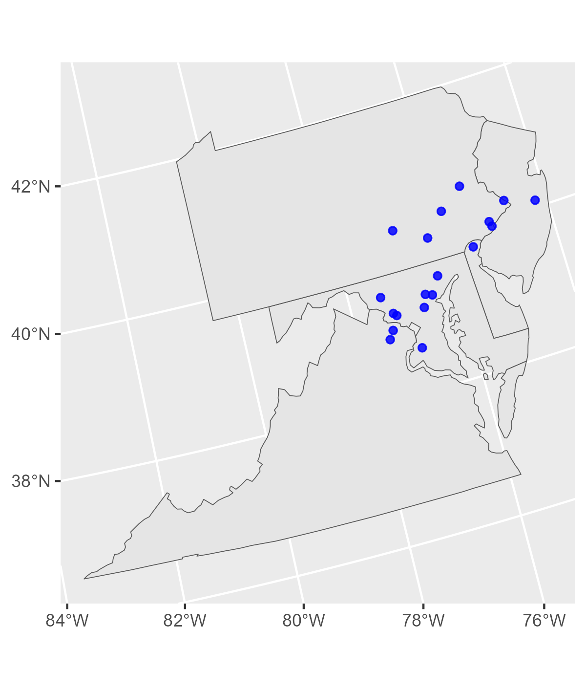
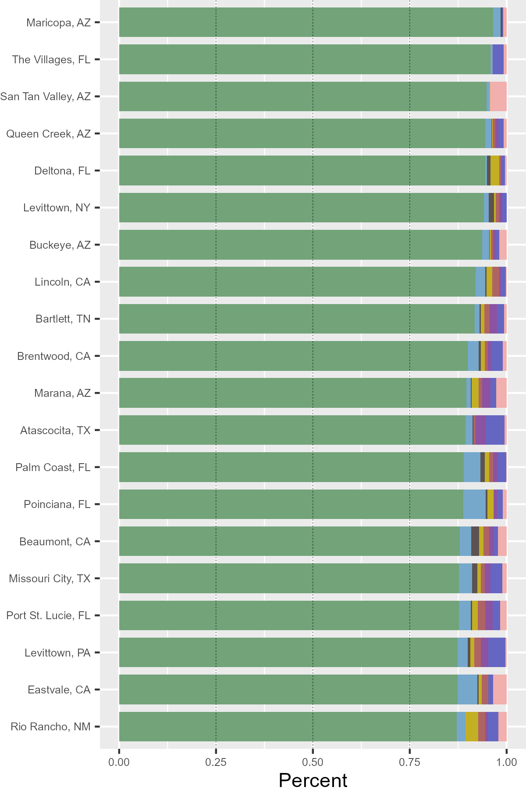
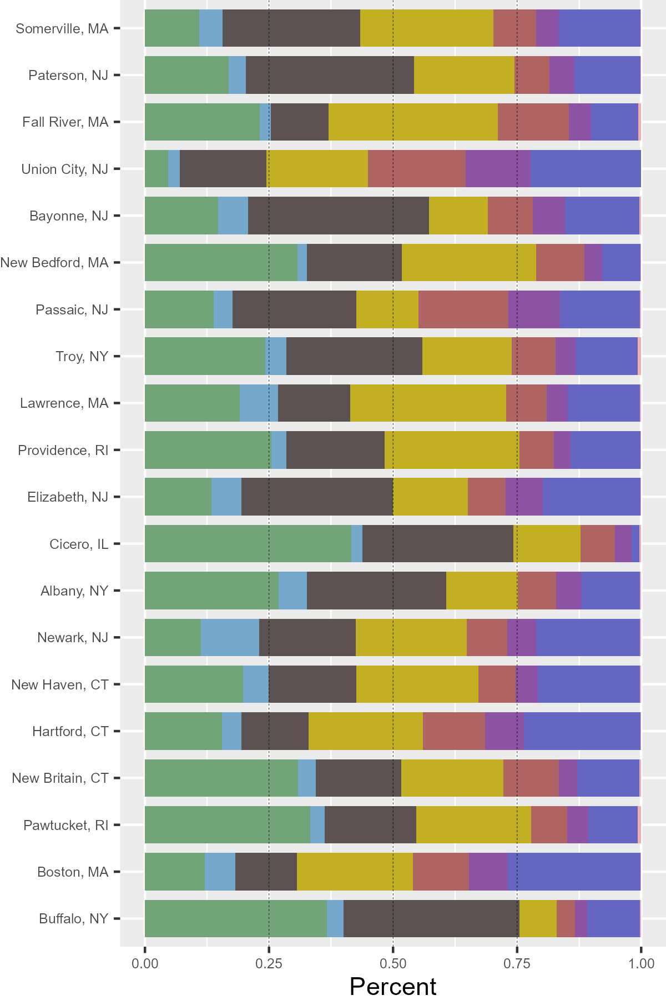

# Housing by Occupied Unit Count

In September of 2015, the Washington Post [analyzed census data to asses the breakdown of housing by unit count](https://tinyurl.com/bdd2nx45) for major American cities. After reading that article, I had a lot of follow-up questions and interest in how other cities and housing types shook out.

First, the Washington Post analysis only included *large* U.S. cities. If we include cities down to 50,000 population, are there any that have a lower proportion of single-family detached housing than New York or Philadelphia?

### All cities with the least single-family detached housing

  
 
  

As it turned out, yes, there are! They broadly fall into 2 categories:

1.  Concentrated high density.

2.  Single-family attached houses (rowhouses or townhouses) as a default instead of single-family detached houses.

And both of these types of cities are geographically concentrated in specific areas. When sorting by the highest proportion of the densest housing type, we can see two subcategories that fall into the first type: major cities such as New York and surroundings or Florida beachside communities with extensive condo development:

### All cities with the most high-density housing

  
 
  

The second type is even more concentrated into one specific U.S. region, which becomes especially clear when we look at a list of the cities with the highest proportion of single-family attached housing:

### All cities with the most single-family attached housing

  
 
  
 
  

All of the top 19 are located in the mid-Atlantic, particularly around Philadelphia and surroundings. Only #20, Palm Desert, CA, is located elsewhere.

So far we've looked at the cities with the least single-family detached housing, but what about the opposite? Where do we find the cities with the *most* single-family detached housing?

### All cities with the most single-family detached housing
 
  
 
  

It's actually quite rare to find cities where over 90% of occupied units are single-family detached housing. Of those that are, several are planned communities such as The Villages or Levittowns that were explicitly intended to only contain single-family detached housing.

Finally, that leaves us with "missing middle" housing: more dense than single-family housing but less so than mid-rise apartments. 

Are there any U.S. cities where this type of housing predominates?

### All cities with the most "missing-middle" housing

  
 
  

Older, mid-sized Northeastern cities, as it turns out. These are places in which the housing stock was mostly constructed before automobiles but also places that did not grow so large or dense that this housing got torn down and replaced with higher density.

*This research is an extension of the analysis performed in:*

*Badger, E., & Ingraham, C. (2015, September 21). "The most popular type of home in every major American city, charted" - The Washington Post. [https://tinyurl.com/bdd2nx45](https://tinyurl.com/bdd2nx45%22)*
