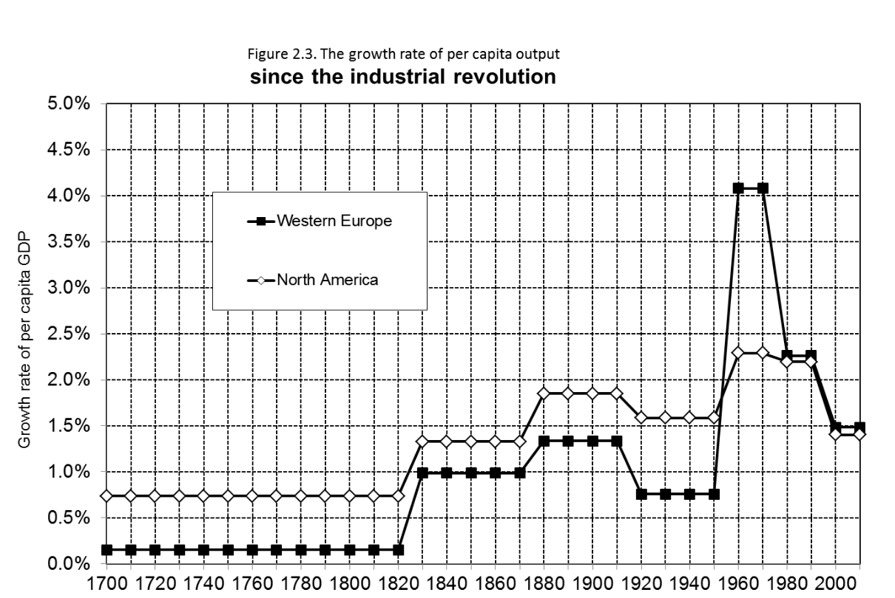
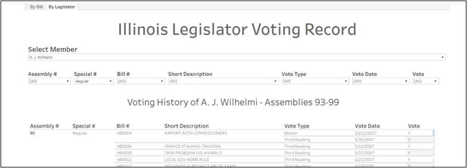

## Professional Work

### Texas Juvenile Justice Department

**Performance dashboards**

Business lead in setup of Power BI report server deployment for agency. Created multiple dashboards monitoring facility incidents, employee turnover, overtime usage, and other agency processes. Data unavailable publicly due to legal restrictions.

_(Screenshots pending public information request)_

**One-pagers**

Developed explanatory documents of juvenile justice system and processes for external stakeholders.

_(Examples pending public information request)_

**Public Presentations**

Regularly provided updates to TJJD governing board and executive staff on the current state of the juvenile justice system. Example:

[TJJD Governing Board, May 24, 2024](https://www.tjjd.texas.gov/index.php/doc-library/category/731-may-24-2024)

[- Materials](https://www.tjjd.texas.gov/index.php/doc-library/send/731-may-24-2024/3517-tjjd-waitlist-causes-and-options-may-2024)

[- Video (appearance around 58:00)](https://register.gotowebinar.com/recording/4413543467425033822)

**Data science**

Modeled population projections and the impacts of release criteria on recidivism. Data unavailable publicly due to legal restrictions.

_(Screenshots pending public information request)_

---
### Criminal Justice Division of Texas' Office of the Governor

**Portfolio Review** 

Performance assessments of all agency grants organized by funding source and program type.

  
  

**Resources for Local Criminal Justice Planning** 

Annual compilation of criminal justice and victims services data produced for each of the 24 Councils of Government of Texas. Data unavailable publicly due to privacy restrictions.

  

---

## Publications

[“Learning From Failure: ‘Red flags’ in Body-worn Camera Data.” Real World Data Science, November 16, 2023.](https://realworlddatascience.net/case-studies/posts/2023/11/16/learning-from-failure.html)
  
  
  
---

[Wright, Noah. 2023. “The Politics of Performance Measurement.” Real World Data Science, April 18, 2023.](https://realworlddatascience.net/careers/posts/2023/04/18/politics-of-performance-measurement.html)

  
  
---

["Data Visualization in _Capital in the 21st Century_" World Economic Review 5: 54-72, 2015.](http://wer.worldeconomicsassociation.org/papers/data-visualization-in-capital-in-the-21st-century/)

  

---

## Personal Projects

[Illinois Legislative Vote Tracker](https://public.tableau.com/app/profile/noahwright/viz/IllinoisLegislatorVotingRecord/ByBill)

  Scraped 76,000+ vote record PDF's from ilga.gov and created structured dataset for ease of analysis. Published simple Tableau interface (linked above) for 93rd-99th General Assembly. Please follow up if interested in more recent sessions.

  
  
---
[These Two Maps Have Equal Population](https://medium.com/@noah-degrange/these-two-maps-have-equal-population-1ea46d5ac233) 

Compared permutations of U.S. population density display maps and their implications.

  

  [(GitHub)](https://github.com/enndubbs/Population-Density)

---
[What is “Majority-Minority” and Why is it Stupid to Obsess Over?](https://noah-degrange.medium.com/what-is-majority-minority-and-why-is-it-stupid-to-obsess-over-acc6ea941a0f) 

Analyzed long-term American demographic trends, and why they aren't that big of a deal.

  

  [(GitHub)](https://github.com/enndubbs/Majority-Minority)

---

## About

Noah Wright is a data professional with over a decade of experience in quantitative research, analytics, grantmaking, teaching, and management. In his career he has worked on topics including criminal justice, education, workforce development, poverty, and urban issues.

He currently works as a Data Strategist for the Texas Juvenile Justice Department and volunteers for local pro-housing organizations. In his free time he overthinks pop culture and hosts a book club on [the history of Chicago](https://chipublib.bibliocommons.com/events/66672e7fe3e1ee3000432774/)

---

Page template forked from <a href="https://github.com/evanca/quick-portfolio">evanca</a>

<!-- Remove above link if you don't want to attibute -->
